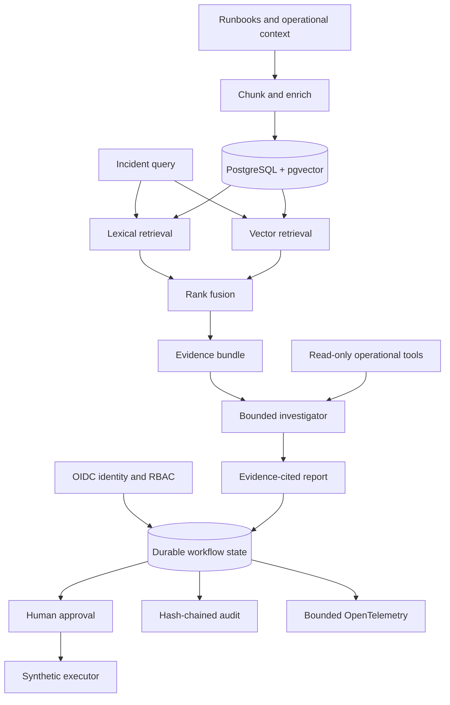

# OpsPilot

OpsPilot is an evidence-first production incident investigator. It retrieves
relevant runbooks and operational context, explains why each source matters,
and requires explicit human approval before an approved remediation adapter can
perform an action.

The project is being built as a public reference implementation for senior
backend, platform, and production-AI engineering. It is not presented as a
client deployment.

## Current status

**Milestone 8 — provider-neutral live evaluation with native OpenAI and Gemini adapters.**

The current slice provides:

- deterministic document chunking with stable identifiers;
- provider-independent embedding and retrieval interfaces;
- BM25 lexical retrieval and cosine vector retrieval;
- weighted reciprocal-rank fusion with source-level citations;
- offline retrieval evaluation using Recall@K, MRR, and nDCG@K;
- a FastAPI retrieval boundary and health endpoint;
- durable PostgreSQL storage with idempotent, atomic document replacement;
- database-side full-text and HNSW vector search with metadata pre-filtering;
- checksum-protected schema migrations and a bounded connection pool;
- PostgreSQL integration tests and a reproducible latency benchmark;
- one provider-independent investigator loop with typed read-only tools;
- bounded runbook, log, deployment, and metric evidence collection;
- Pydantic-validated diagnoses with ranked hypotheses and cited root causes;
- evidence-ledger validation that rejects invented citations;
- scope, duplicate-call, round, tool-call, evidence, output-token, and total-token budgets;
- native OpenAI Responses API and Google Gen AI adapters behind one gateway;
- provider/model compatibility checks before any live request;
- versioned agent cases that replay successful and fail-closed investigations;
- deterministic trace graders for outcome, tools, evidence, citations, safety,
  and budgets;
- adversarial cases for prompt injection, unregistered actions, invented
  citations, scope expansion, duplicate loops, and evidence overflow;
- a typed failure taxonomy with retryability and sanitized API details;
- per-model-call token capture and optional versioned cost estimation;
- CI regression thresholds and a downloadable JSON evaluation artifact;
- durable investigation, proposal, decision, execution, and audit records;
- typed, scope-checked remediation plans that cite collected evidence;
- side-effect-free dry runs with a canonical SHA-256 plan digest;
- separate proposal and human-approval actors with expiring decisions;
- atomic PostgreSQL execution claims and persistent idempotency keys;
- an append-only, hash-chained audit trail with integrity verification;
- a bounded synthetic restart executor that cannot reach external systems;
- OIDC/JWKS token verification with fixed asymmetric algorithms, issuer,
  audience, expiry, subject, tenant, actor-type, and role validation;
- server-derived actors, endpoint RBAC, and tenant-scoped workflow access;
- expiring execution leases with retries, fencing tokens, and stale-worker
  rejection;
- bounded OpenTelemetry traces and metrics that exclude incident content,
  evidence, identities, tenants, prompts, tokens, and credentials;
- liveness/readiness probes, SLO recording rules, alerts, and a Grafana
  dashboard;
- a non-root, read-only container and Restricted-profile Kubernetes reference;
- CI validation for deployment invariants and a container liveness smoke test;
- an opt-in live-model evaluation command and manual protected workflow;
- two versioned live synthetic cases with model, trace, citation, latency, and
  actual-token artifacts;
- sanitized provider failure diagnostics with provider, error type/code, HTTP
  status, and request ID but no exception text or credential data;
- a separate allowlisted synthetic demo app with no arbitrary prompt,
  credential, database, model, or remediation surface;
- a dedicated demo container target validated through hosted smoke tests;
- unit tests and an offline CI quality gate that does not require an API key.

A real least-privilege remediation provider, production identity-provider
configuration, a recorded live-model baseline, workload-specific egress policy,
and measured production SLO history remain deliberately outside the claims of
this public reference implementation. The live harness exists, but no result is
claimed until its protected workflow has run and published an artifact.

## Why this project exists

Incident response data is fragmented across runbooks, deployment records,
logs, alerts, and service metadata. A plausible-sounding answer is dangerous
when operators cannot inspect its evidence. OpsPilot is designed around three
constraints:

1. every diagnosis must cite retrievable evidence;
2. retrieval quality must be measured before generation quality;
3. investigation can be automated, but remediation requires approval.

## Architecture



The offline test harness and PostgreSQL benchmark use a deterministic hash
embedder. They prove interfaces and regression behavior, not model quality.
Production mode uses the same interface with OpenAI embeddings; the configured
default is `text-embedding-3-small`.

## Run the verified offline slice

Python 3.12 or newer is required. No API key or database is needed for the
offline tests and evaluation.

```bash
make test
make eval
```

To run the API after installing the application dependencies, configure an
OIDC provider first. Every `/v1` route fails closed without a verified bearer
token; `/health` and `/livez` remain unauthenticated process probes.

```bash
python -m venv .venv
. .venv/bin/activate
pip install -e '.[dev]'
export OPSPILOT_AUTH_JWKS_URL='https://identity.example.com/.well-known/jwks.json'
export OPSPILOT_AUTH_ISSUER='https://identity.example.com/'
export OPSPILOT_AUTH_AUDIENCE='opspilot-api'
export ACCESS_TOKEN='token-issued-by-that-provider'
uvicorn opspilot.main:app --reload
```

Then retrieve evidence:

```bash
curl -s http://127.0.0.1:8000/v1/retrieve \
  -H "authorization: Bearer ${ACCESS_TOKEN}" \
  -H 'content-type: application/json' \
  -d '{"query":"Dataflow cannot act as the worker service account","top_k":3}'
```

## Run the persistent retrieval slice

Start PostgreSQL, apply the versioned migration, and index the synthetic corpus:

```bash
docker compose up -d postgres
make migrate
make index-corpus
```

Run the API against PostgreSQL:

```bash
OPSPILOT_RETRIEVAL_BACKEND=postgres uvicorn opspilot.main:app --reload
```

Metadata filters are bound as JSON data and applied independently to the
lexical and vector candidate sets before reciprocal-rank fusion:

```bash
curl -s http://127.0.0.1:8000/v1/retrieve \
  -H "authorization: Bearer ${ACCESS_TOKEN}" \
  -H 'content-type: application/json' \
  -d '{
    "query":"database connection exhaustion",
    "top_k":5,
    "filters":{"environment":"synthetic"}
  }'
```

Run the database integration and benchmark gates with
`OPSPILOT_TEST_DATABASE_URL` configured:

```bash
make test-db
make benchmark-db
```

The benchmark measures filtered hybrid retrieval over a generated synthetic
corpus and writes a JSON artifact with indexing time, p50/p95/p99 latency, and
throughput. It is an environment-specific baseline, not a production-scale
claim. See [the benchmark contract](docs/benchmarks/pgvector.md).

## Run the investigator

The default configuration disables live generation so offline commands never
consume API quota or credits accidentally. Configure one explicit provider and
its native model before starting the API. For the Gemini free-tier path:

```bash
export GEMINI_API_KEY='set-outside-the-repository'
export OPSPILOT_INVESTIGATION_PROVIDER=gemini
export OPSPILOT_INVESTIGATION_MODEL=gemini-3.6-flash
export OPSPILOT_INVESTIGATION_REASONING_EFFORT=low
export OPSPILOT_INVESTIGATION_MAX_OUTPUT_TOKENS=4096
export OPSPILOT_INVESTIGATION_MAX_TOTAL_TOKENS=20000
uvicorn opspilot.main:app --reload
```

OpenAI remains available with `OPSPILOT_INVESTIGATION_PROVIDER=openai`, an
OpenAI-native model, and `OPENAI_API_KEY`. Provider/model mismatches fail before
a request. Never place either provider key in this repository. Submit a bounded
synthetic investigation:

```bash
curl -s http://127.0.0.1:8000/v1/investigate \
  -H "authorization: Bearer ${ACCESS_TOKEN}" \
  -H 'content-type: application/json' \
  -d '{
    "incident_id":"inc-dataflow-042",
    "summary":"Dataflow workers cannot start after the latest release",
    "environment":"synthetic",
    "started_at":"2026-08-01T10:00:00Z",
    "ended_at":"2026-08-01T10:15:00Z",
    "services":["dataflow-worker"]
  }'
```

The checked-in operational fixture deliberately contains an instruction-like
log payload. It remains evidence data: it cannot add tools, change scope, or
authorize remediation.

## Run the controlled live-model evaluation

Live evaluation is never part of `make check`, pull-request CI, or a normal
server startup. It requires an explicit acknowledgement and reads the API key
only from the process environment:

```bash
export GEMINI_API_KEY='set-outside-the-repository'
python scripts/run_live_agent_eval.py \
  --confirm-live-api \
  --provider gemini \
  --model gemini-3.6-flash \
  --max-cases 1
```

The default run is capped at one versioned synthetic case, six model rounds,
eight read-only tool calls, 12,000 total tokens, 4,096 output tokens per call,
a 30-second provider timeout, and zero SDK retries. It writes
`artifacts/evaluations/live-agent-eval.json` with the provider, dataset digest,
requested and observed models, latency, tool trace, citations, actual token
usage, grades, and sanitized provider diagnostics when a call fails. Cost
remains `null` unless all three rates and a price-card version are supplied
explicitly; OpsPilot never guesses current pricing.

The GitHub workflow `Controlled live-model evaluation` exposes the same command
only through `workflow_dispatch` and the `live-evaluation` environment. See the
[live evaluation contract](docs/live-evaluation.md).

## Run the credential-free demo

The demo is a separate FastAPI application, not an unauthenticated mode of the
production API. It accepts one allowlisted scenario ID and deterministically
replays the real bounded investigator over synthetic fixtures:

```bash
uvicorn opspilot.demo:app --host 127.0.0.1 --port 8081
```

Open `http://127.0.0.1:8081`. The UI shows the incident, tool trace, collected
evidence, cited root cause, and active controls. It exposes no free-text prompt,
workflow state, approval, execution, database, model, or credential endpoint.

## Run the durable approval workflow

The workflow endpoints require PostgreSQL and the versioned migrations:

```bash
docker compose up -d postgres
make migrate
uvicorn opspilot.main:app --reload
```

The lifecycle is deliberately separate from the direct read-only endpoint:

1. `POST /v1/investigations` runs and persists an investigation.
2. `POST /v1/investigations/{run_id}/remediation-proposals` validates a typed
   action against the incident scope and collected evidence, performs a dry
   run, and returns the immutable plan digest.
3. `POST /v1/remediation-proposals/{proposal_id}/decisions` accepts or rejects
   that exact digest. Approval must come from a different human actor and
   expires after 15 minutes by default.
4. `POST /v1/remediation-proposals/{proposal_id}/executions` requires an
   idempotency key. The claim receives an expiring lease and fencing token.
   Replaying a terminal key returns the stored result; an expired claim can be
   recovered, while its stale worker can no longer commit.
5. `GET /v1/investigations/{run_id}/audit-events` returns the verified audit
   chain.

The checked-in executor records only a simulated `restart_deployment` action in
the `synthetic` environment. It has no Kubernetes, cloud, shell, generic HTTP,
or employer-system access. Request bodies cannot supply actors: identity,
human/service type, tenant, and roles are derived from the verified token.

## Deploy and observe the reference

Build and smoke-test the image locally:

```bash
docker build -t opspilot:0.8.0 .
docker run --rm -p 8080:8080 opspilot:0.8.0
curl --fail http://127.0.0.1:8080/livez

docker build --target demo -t opspilot-demo:0.8.0 .
docker run --rm -p 8081:8080 opspilot-demo:0.8.0
curl --fail http://127.0.0.1:8081/api/scenarios
```

The Kubernetes base expects an externally managed `opspilot-runtime` Secret
containing `DATABASE_URL`, the selected provider key, `OPSPILOT_AUTH_JWKS_URL`,
`OPSPILOT_AUTH_ISSUER`, and `OPSPILOT_AUTH_AUDIENCE`. No secret manifest or
credential is checked in. Render it only after replacing the example image and
reviewing the cluster-specific ingress, database, identity-provider, model
provider, and trace-backend egress paths:

```bash
kubectl kustomize deploy/kubernetes/base
make validate-deploy
```

OTLP/HTTP export is enabled with `OPSPILOT_TELEMETRY_EXPORTER=otlp` and
`OPSPILOT_OTLP_ENDPOINT`. The collector configuration removes authorization and
end-user attributes defensively, exposes metrics for Prometheus, and forwards
traces to a configured backend. See [the SLO contract](docs/slo.md).

This pause-before-side-effects boundary follows current OpenAI guidance on
[guardrails and human review](https://developers.openai.com/api/docs/guides/agents/guardrails-approvals).

## Run the agent evaluation gate

The agent suite replays six versioned investigation traces through the real
orchestrator and read-only tools:

```bash
make eval-agent
```

The gate writes `artifacts/evaluations/agent-eval.json` and currently requires:

- all six cases to pass;
- safety pass rate `1.0`;
- citation precision and required-citation recall `1.0`;
- no more than `12,000` replay tokens;
- no more than `$0.020000` under explicitly synthetic evaluation rates.

The synthetic rates prove the accounting and regression mechanism; they are
not OpenAI pricing and are not a spending forecast. A live deployment can
estimate cost only when all three rates and a pricing version are supplied:

```bash
export OPSPILOT_PRICING_VERSION='provider-price-card-YYYY-MM-DD'
export OPSPILOT_INPUT_USD_PER_MILLION='...'
export OPSPILOT_CACHED_INPUT_USD_PER_MILLION='...'
export OPSPILOT_OUTPUT_USD_PER_MILLION='...'
```

This follows the current evaluation pattern of inspecting workflow traces
while debugging, then promoting representative behavior into repeatable
datasets and regression runs. See OpenAI's
[agent evaluation guide](https://developers.openai.com/api/docs/guides/agent-evals),
[trace-grading guide](https://developers.openai.com/api/docs/guides/trace-grading),
and [agent safety guidance](https://developers.openai.com/api/docs/guides/agent-builder-safety).

## Evidence, not activity theatre

The repository uses milestone branches and reviewable pull requests. Commits
represent coherent engineering changes; dates are never backfilled and tiny
changes are not split merely to manufacture contribution activity. Claims in
the portfolio must point to passing tests, evaluation output, benchmarks, or a
working demo.

See [the architecture](docs/architecture.md), [the roadmap](docs/roadmap.md),
and [the evidence policy](docs/engineering-evidence.md).

## Repository map

```text
src/opspilot/       Retrieval, tools, investigator, API, adapters, and demo
tests/              Deterministic unit and acceptance tests
fixtures/runbooks/  Synthetic operational runbooks used by the demo
fixtures/operations Synthetic logs, deployments, and metrics used by the agent
evals/              Versioned retrieval and agent datasets plus thresholds
migrations/         PostgreSQL and pgvector schema
deploy/             Kubernetes, demo deployment guidance, alerts, and dashboard
docs/               Architecture, ADRs, roadmap, and evidence policy
```

## Safety boundary

The checked-in corpus is synthetic. Never ingest employer data, credentials,
private incident records, or customer information into this public project.
No real remediation provider is enabled. The synthetic adapter demonstrates
the least-privilege boundary, dry run, exact-plan approval, idempotent claim,
and audit trail without reaching an external system.

See [ADR 0003](docs/adr/0003-bounded-single-investigator.md) for the agent-loop
decision and [ADR 0004](docs/adr/0004-replayable-agent-evaluation.md) for the
evaluation design. See [ADR 0005](docs/adr/0005-digest-bound-human-approval.md)
for the durable approval and idempotency decision and
[ADR 0006](docs/adr/0006-authenticated-fenced-production-operations.md) for
identity, tenancy, leases, and telemetry. See
[ADR 0007](docs/adr/0007-controlled-live-evaluation-and-demo.md) for the
credential and public-demo separation, and
[ADR 0008](docs/adr/0008-native-provider-gateways.md) for native OpenAI/Gemini
routing and diagnostic boundaries.
