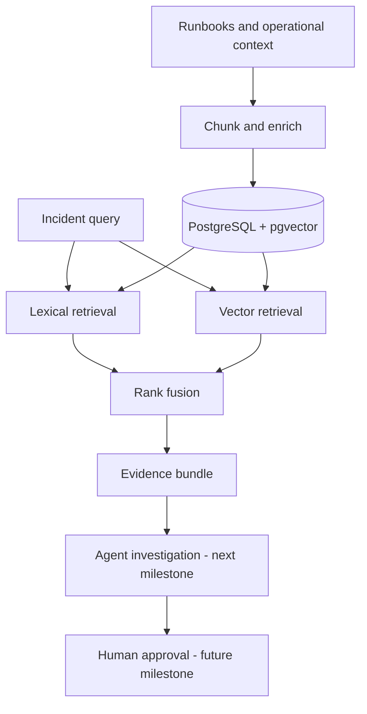

# OpsPilot

OpsPilot is an evidence-first production incident investigator. It retrieves
relevant runbooks and operational context, explains why each source matters,
and will require explicit human approval before any future remediation action.

The project is being built as a public reference implementation for senior
backend, platform, and production-AI engineering. It is not presented as a
client deployment.

## Current status

**Foundation milestone — implemented locally, publication pending.**

The current slice provides:

- deterministic document chunking with stable identifiers;
- provider-independent embedding and retrieval interfaces;
- BM25 lexical retrieval and cosine vector retrieval;
- weighted reciprocal-rank fusion with source-level citations;
- offline retrieval evaluation using Recall@K, MRR, and nDCG@K;
- a FastAPI retrieval boundary and health endpoint;
- a PostgreSQL/pgvector schema with HNSW and full-text indexes;
- unit tests and a CI quality gate that does not require an API key.

Agent orchestration, production storage integration, evidence synthesis,
guardrails, approvals, and tracing are deliberately separate milestones.

## Why this project exists

Incident response data is fragmented across runbooks, deployment records,
logs, alerts, and service metadata. A plausible-sounding answer is dangerous
when operators cannot inspect its evidence. OpsPilot is designed around three
constraints:

1. every diagnosis must cite retrievable evidence;
2. retrieval quality must be measured before generation quality;
3. investigation can be automated, but remediation requires approval.

## Architecture



The offline test harness uses a deterministic hash embedder. Production mode
will use the same interface with OpenAI embeddings; the current official
default is configurable and set to `text-embedding-3-small`.

## Run the verified offline slice

Python 3.12 or newer is required. No API key or database is needed for the
offline tests and evaluation.

```bash
make test
make eval
```

To run the API after installing the application dependencies:

```bash
python -m venv .venv
. .venv/bin/activate
pip install -e '.[dev]'
uvicorn opspilot.main:app --reload
```

Then retrieve evidence:

```bash
curl -s http://127.0.0.1:8000/v1/retrieve \
  -H 'content-type: application/json' \
  -d '{"query":"Dataflow cannot act as the worker service account","top_k":3}'
```

## Evidence, not activity theatre

The repository uses milestone branches and reviewable pull requests. Commits
represent coherent engineering changes; dates are never backfilled and tiny
changes are not split merely to manufacture contribution activity. Claims in
the portfolio must point to passing tests, evaluation output, benchmarks, or a
working demo.

See [the architecture](docs/architecture.md), [the roadmap](docs/roadmap.md),
and [the evidence policy](docs/engineering-evidence.md).

## Repository map

```text
src/opspilot/       Retrieval domain, adapters, evaluation, and API
tests/              Deterministic unit and acceptance tests
fixtures/runbooks/  Synthetic operational runbooks used by the demo
evals/              Versioned golden-query datasets
migrations/         PostgreSQL and pgvector schema
docs/               Architecture, ADRs, roadmap, and evidence policy
```

## Safety boundary

The checked-in corpus is synthetic. Never ingest employer data, credentials,
private incident records, or customer information into this public project.
No remediation tool will be enabled without a least-privilege design, audit
trail, dry-run behavior, and a human approval interruption.
